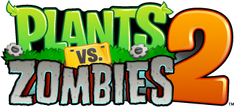

***

# Plants vs. Zombies 2

# By

# And

### Top

# `README.md`

***

# Index

[00.0 - Top](#Top)

[01.0 - Index](#Index)

[02.0 - Description](#SeansLifeArchive_Images_PVZ2)

[03.0 - About](#About)

[04.0 - Wiki](#Wiki)

[05.0 - Version history](#Version-history)

[06.0 - Software status](#Software-status)

[07.0 - Contributers](#Contributers)

[08.0 - Issues](#Issues)

> [08.1 - Current issues](#Current-issues)

> [08.2 - Past issues](#Past-issues)

> [08.3 - Past pull requests](#Past-pull-requests)

> [08.4 - Active pull requests](#Active-pull-requests)

[09.0 - Resources](#Resources)

[10.0 - Contributing](#Contributing)

[11.0 - About README](#About-README)

[12.0 - README Version history](#README-version-history)

[13.0 - Footer](#You-have-reached-the-end-of-the-README-file)

***

# SeansLifeArchive_Images_PVZ2
 The module for my life story project that contains my Plants vs. Zombies 2 images.

***

## About

See above

***

## Wiki

[Click/tap here to view this projects Wiki](https://github.com/seanpm2001/SeansLifeArchive_Images_PVZ2/wiki)

***

## Version history

Unavailable

[More versions coming soon](https://www.example.com)

***

## Software status

All of my works are free from restrictions. DRM (**D**igital **R**estrictions **M**anagement) is not present in any of my works. This project does not contain any DRM

This sticker is supported by the Free Software Foundation. I never intend to include DRM in my works. The game in question does include DRM though.

***

## Contributers

Currently, I am the only contributer. Contributing is not allowed, as this is a personal project.

> * 1. [seanpm2001](https://github.com/seanpm2001/) - 82 commits (As of Sunday, January 24th 2021 at 8:00 pm)

> * 2. No other contributers.

***

## Issues

### Current issues

* [1. Longevity re-uploads - Septmeber 7th 2020](https://github.com/seanpm2001/SeansLifeArchive_Images_PVZ2/issues/1)

* No other current issues

### Past issues

None at the moment

### Past pull requests

None at the moment

### Active pull requests

None at the moment

***

## Resources

Here are some other resources for this project:

[Project language file](LANG.scala)

[Join the discussion on GitHub](https://github.com/seanpm2001/SeansLifeArchive_Images_PVZ2/discussions)

[Plants vs. Zombies 2 on the Apple App Store](https://apps.apple.com/us/app/plants-vs-zombies-2/id597986893)

[Plants vs. Zombies 2 on the Google Play Store](https://play.google.com/store/apps/details?id=com.ea.game.pvz2_na&hl=en&gl=us)

**APK link can't be provided, as the game is too locked down (DRM) it is one of the few apps I know of that doesn't easily work in a virtual machine**

No other resources at the moment.

***

## Contributing

Contributing is not allowed for this project, as it is a personal project.

[Click/tap here to view the contributing rules for this project](CONTRIBUTING.md)

***

## About README

File type: `Markdown (*.md)`

File version: `2 (Sunday, January 24th 2021 at 8:00 pm)`

Line count: `0,242`

***

## README version history

Version 1 (Saturday, September 12th 2020 at 7:24 pm)

> Changes:

> * Started the file

> * Added the title section

> * Added the index

> * Added the about section

> * Added the Wiki section

> * Added the version history section

> * Added the contributors section

> * Added the contributing section

> * Added the about README section

> * Added the README version history section

> * No other changes in version 1

Version 2 (Sunday, January 24th 2021 at 8:00 pm)

> Changes:

> * Added icon and developer images

> * Updated the index

> * Updated the contributing section

> * Updated the contributers section

> * Added the software status section

> * Added the resources section

> * Added the current issues section

> * Updated the file history section

> * Updated the file info section

> * No other changes in version 2

Version 3 (coming soon)

> Changes:

> * Coming soon

> * No other changes in version 3

Version 4 (coming soon)

> Changes:

> * Coming soon

> * No other changes in version 4

***

### You have reached the end of the README file

[Back to top](#Top) [Exit](https://github.com)

***
